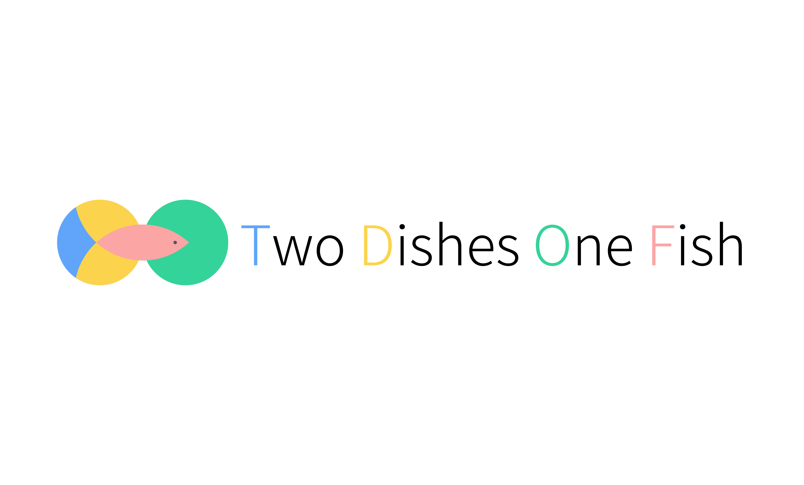

# Two Dishes One Fish

    

A VuePress-next template to build a static web site as blog and knowledge management system.

## Introduction
*"Two dishes one fish"* is a smart cuisine using different part of one fish to make two delicious dishes, inspired by it I want to build web site as a blog and a knowledge management system, with the same Markdown files system.

I choose [VuePress](https://v2.vuepress.vuejs.org/) as the generator to compile the Markdown files to HTML files and deploy the static site to Github Page.

VuePress is so easy to use by the out-of-the-box default theme just [setting some configurations](https://v2.vuepress.vuejs.org/reference/default-theme/config.html). My major work is to optimise the experience of browser the website and post:

* the Markdown files can classify into tow types, it can be a blog post and a note at the same time, or just as a note.
* add a blog posts navigation page, the blog post show as cards, user can browser the posts in three mode: cards grid mode, cards masonry mode, and posts list mode.
* add a notes navigation page, all Markdown files will be notes, the notes show in a grid layout as the same structure as they save in the files system, powering by [D3.js](https://d3js.org/), you can also browser the notes in a tree chart.
* support to add tags to Markdown file and filter the posts or notes in navigation page.
* follow the RWD, responsive web design, principle, you can browser the website in different screen size.
## Demo
* Live Demo: [Collection](https://benbinbin.github.io/Collection/)
* Video Demo: [Youtube](https://youtu.be/cTJmWhbQ9Qg) | [Bilibili](https://www.bilibili.com/video/BV1W64y1X7ok)
## Wiki
* Checkout the [Documentation](https://github.com/Benbinbin/two-dishes-one-fish/wiki/Documentation) of [wiki](https://github.com/Benbinbin/two-dishes-one-fish/wiki) to use this template and build your own site.
* 根据 wiki 的[使用说明](https://github.com/Benbinbin/two-dishes-one-fish/wiki/%E4%BD%BF%E7%94%A8%E8%AF%B4%E6%98%8E)或[少数派的文章](https://sspai.com/post/67518)的步骤搭建自己的网站。在 wiki 的[开发日志](https://github.com/Benbinbin/two-dishes-one-fish/wiki/%E5%BC%80%E5%8F%91%E6%97%A5%E5%BF%97)或[掘金的文章](https://juejin.cn/post/6980134339434512421)可查看该项目的开发笔记。

## License

[MIT](./LICENSE)